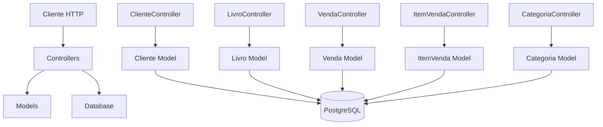
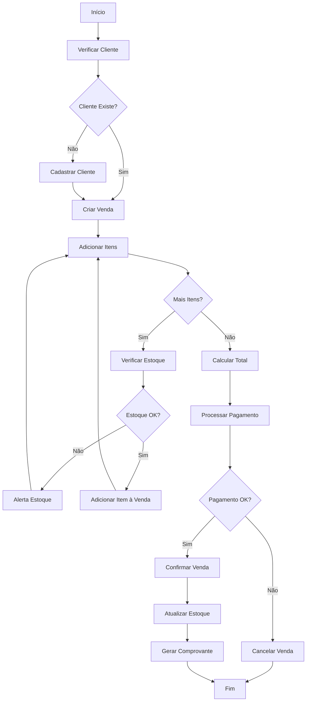
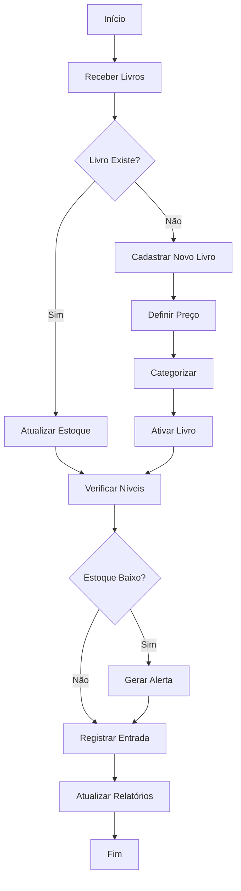
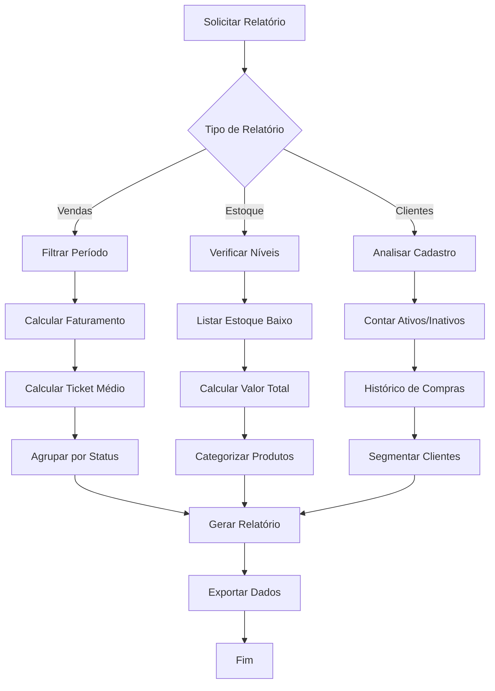
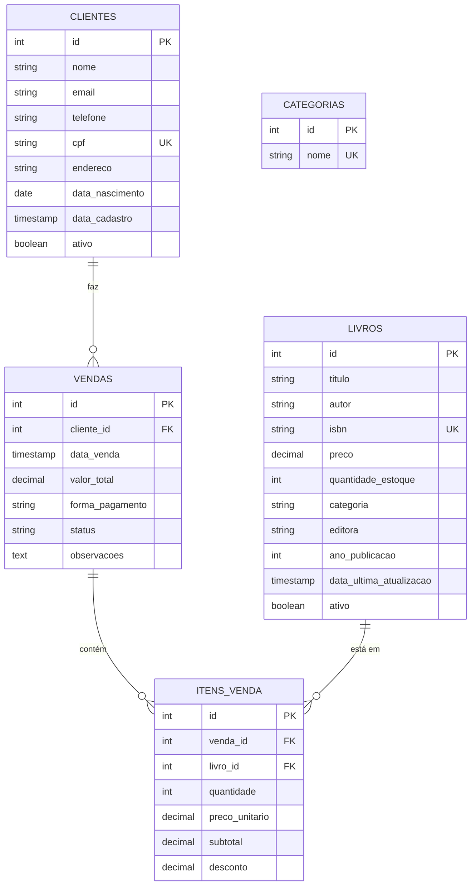

# 📚 Sistema de Gerenciamento de Livraria - Documentação Completa

## 📋 Índice

1. [Visão Geral](#Visão-Geral)
2. [Arquitetura do Sistema](#Arquitetura-do-Sistema)
3. [Modelagem UML](#Modelagem-UML)
4. [Fluxos de Uso](#Fluxos-de-Uso)
5. [Documentação da API](#Documentação-da-API)
6. [Banco de Dados](#Banco-de-Dados)
7. [Instalação e Execução](#Instalação-e-Execução)
8. [Casos de Uso](#Casos-de-Uso)
9. [Exemplos Práticos](#Exemplos-Práticos)
10. [Considerações Técnicas](#Considerações-Técnicas)

---

## 🎯 Visão Geral

Sistema completo para gerenciamento de livraria desenvolvido em **Go** com banco de dados **PostgreSQL**. Permite controle de estoque, cadastro de clientes, processamento de vendas e geração de relatórios.

### ✨ Funcionalidades Principais
- 👥 **Gestão de Clientes**: Cadastro, edição, busca e controle de status
- 📚 **Controle de Estoque**: Gerenciamento completo de livros e categorias
- 💰 **Processamento de Vendas**: Carrinho, itens, pagamento e confirmação
- 📊 **Relatórios**: Vendas, estoque, clientes e análises financeiras
- 🔄 **Operações CRUD**: Create, Read, Update, Delete para todas as entidades

### 🛠️ Tecnologias Utilizadas
- **Backend**: Go (Golang)
- **Banco de Dados**: PostgreSQL
- **Containerização**: Docker & Docker Compose
- **Arquitetura**: MVC (Model-View-Controller)
- **API**: REST

---

## 🏗️ Arquitetura do Sistema

### Estrutura de Pastas
```
LivrariaGo/
├── Controllers/
│   ├── ClienteController.go
│   ├── CategoriaController.go
│   ├── LivroController.go
│   ├── VendaController.go
│   └── ItemVendaController.go
├── Models/
│   ├── Cliente.go
│   ├── Categoria.go
│   ├── Livro.go
│   ├── Venda.go
│   └── ItemVenda.go
├── Db/
│   └── connection.go
├── init.sql
├── main.go
├── docker-compose.yml
└── Dockerfile
```

### Padrão Arquitetural



---

## 🎨 Modelagem UML

### Diagrama de Classes Completo

┌─────────────────────────────────┐
│            Categoria            │
├─────────────────────────────────┤
│ - id : int                      │
│ - nome : string                 │
├─────────────────────────────────┤
│ + CreateCategoria() : Response  │
│ + ReadCategoria() : List        │
│ + ReadByIdCategoria() : Category│
│ + ReadByNomeCategoria() : List  │
│ + UpdateCategoria() : Response  │
│ + DeleteCategoria() : Response  │
│ + validarNome() : boolean       │
│ + obterLivros() : List<Livro>   │
│ + contarLivros() : int          │
└─────────────────────────────────┘

┌─────────────────────────────────┐
│              Cliente            │
├─────────────────────────────────┤
│ - id : int                      │
│ - nome : string                 │
│ - email : string                │
│ - telefone : string             │
│ - cpf : string                  │
│ - endereco : string             │
│ - dataNascimento : Date         │
│ - dataCadastro : DateTime       │
│ - ativo : boolean               │
├─────────────────────────────────┤
│ + Create() : Response           │
│ + Read() : List<Cliente>        │
│ + ReadById() : Cliente          │
│ + ReadByNome() : List<Cliente>  │
│ + Update() : Response           │
│ + Delete() : Response           │
│ + validarCPF() : boolean        │
│ + validarEmail() : boolean      │
│ + calcularIdade() : int         │
│ + formatarCPF() : string        │
│ + ativar() : void               │
│ + desativar() : void            │
│ + obterHistoricoCompras() : List│
│ + calcularTicketMedio() : decimal│
└─────────────────────────────────┘

┌─────────────────────────────────┐
│              Livro              │
├─────────────────────────────────┤
│ - id : int                      │
│ - titulo : string               │
│ - autor : string                │
│ - isbn : string                 │
│ - preco : decimal               │
│ - quantidadeEstoque : int       │
│ - categoria : string            │
│ - editora : string              │
│ - anoPublicacao : int           │
│ - dataUltimaAtualizacao : DateTime│
│ - ativo : boolean               │
│ - sinopse : string              │
├─────────────────────────────────┤
│ + CreateLivro() : Response      │
│ + ReadLivro() : List<Livro>     │
│ + ReadByIdLivro() : Livro       │
│ + ReadByTituloLivro() : List    │
│ + ReadByAutorLivro() : List     │
│ + ReadByCategoriaLivro() : List │
│ + ReadEstoqueBaixoLivro() : List│
│ + UpdateLivro() : Response      │
│ + UpdateEstoqueLivro() : Response│
│ + DeleteLivro() : Response      │
│ + validarISBN() : boolean       │
│ + validarPreco() : boolean      │
│ + validarAnoPublicacao() : boolean│
│ + atualizarEstoque() : boolean  │
│ + verificarDisponibilidade() : boolean│
│ + calcularValorEstoque() : decimal│
│ + obterNivelEstoque() : string  │
│ + aplicarDesconto() : decimal   │
│ + gerarEtiqueta() : string      │
└─────────────────────────────────┘

┌─────────────────────────────────┐
│              Venda              │
├─────────────────────────────────┤
│ - id : int                      │
│ - clienteId : int               │
│ - dataVenda : DateTime          │
│ - valorTotal : decimal          │
│ - formaPagamento : string       │
│ - status : string               │
│ - observacoes : string          │
├─────────────────────────────────┤
│ + CreateVenda() : Response      │
│ + ReadVenda() : List<Venda>     │
│ + ReadByIdVenda() : Venda       │
│ + ReadByClienteIdVenda() : List │
│ + ReadByStatusVenda() : List    │
│ + ReadByPeriodoVenda() : List   │
│ + UpdateVenda() : Response      │
│ + ConfirmarVenda() : Response   │
│ + CancelarVenda() : Response    │
│ + DeleteVenda() : Response      │
│ + RelatorioVendas() : Relatorio │
│ + validarFormaPagamento() : boolean│
│ + validarStatus() : boolean     │
│ + calcularTotal() : decimal     │
│ + adicionarItem() : boolean     │
│ + removerItem() : boolean       │
│ + confirmar() : boolean         │
│ + cancelar() : boolean          │
│ + estornar() : boolean          │
│ + gerarComprovante() : string   │
│ + enviarEmailConfirmacao() : boolean│
└─────────────────────────────────┘

┌─────────────────────────────────┐
│            ItemVenda            │
├─────────────────────────────────┤
│ - id : int                      │
│ - vendaId : int                 │
│ - livroId : int                 │
│ - quantidade : int              │
│ - precoUnitario : decimal       │
│ - subtotal : decimal            │
│ - desconto : decimal            │
├─────────────────────────────────┤
│ + CreateItemVenda() : Response  │
│ + ReadItemVenda() : List        │
│ + ReadByIdItemVenda() : ItemVenda│
│ + ReadByVendaIdItemVenda() : List│
│ + ReadByLivroIdItemVenda() : List│
│ + UpdateItemVenda() : Response  │
│ + DeleteItemVenda() : Response  │
│ + calcularSubtotal() : decimal  │
│ + validarQuantidade() : boolean │
│ + aplicarDesconto() : void      │
│ + obterTotal() : decimal        │
└─────────────────────────────────┘

### Relacionamentos Entre Classes

Cliente ──────────┐
    │ 1           │
    │             │ *
    │         ┌───▼────┐
    │         │  Venda │
    │         └───┬────┘
    │             │ 1
    │             │
    │             │ *
    │         ┌───▼─────────┐
    │         │  ItemVenda  │
    │         └───┬─────────┘
    │             │ *
    │             │
    │             │ 1
    │         ┌───▼────┐
    │         │  Livro │
    └─────────┼────────┘
              │ *
              │
              │ 1
         ┌────▼──────┐
         │ Categoria │
         └───────────┘

Legenda:
1   = Um
*   = Muitos
──  = Relacionamento
---

## 🔄 Fluxos de Uso

### 1. Fluxo de Venda Completa



### 2. Fluxo de Gestão de Estoque



### 3. Fluxo de Relatórios



---

## 🌐 Documentação da API

### Base URL
```
http://localhost:8080
```

### 👥 Endpoints de Clientes

| Método | Endpoint | Descrição | Parâmetros |
|--------|----------|-----------|------------|
| `GET` | `/clientes/read` | Listar todos os clientes | - |
| `GET` | `/clientes/readid` | Buscar cliente por ID | `?id=1` |
| `GET` | `/clientes/readnome` | Buscar cliente por nome | `?nome=João` |
| `POST` | `/clientes/create` | Criar novo cliente | Body JSON |
| `PUT` | `/clientes/update` | Atualizar cliente | `?id=1` + Body JSON |
| `DELETE` | `/clientes/delete` | Deletar cliente | `?id=1` |

#### Exemplo de Request/Response Cliente:
```json
// POST /clientes/create
{
    "nome": "João Silva Santos",
    "email": "joao.silva@email.com",
    "telefone": "(83) 99999-1111",
    "cpf": "123.456.789-01",
    "endereco": "Rua das Flores, 123 - Centro",
    "data_nascimento": "1990-05-15"
}

// Response
{
    "id": 1,
    "nome": "João Silva Santos",
    "email": "joao.silva@email.com",
    "telefone": "(83) 99999-1111",
    "cpf": "123.456.789-01",
    "endereco": "Rua das Flores, 123 - Centro",
    "data_nascimento": "1990-05-15T00:00:00Z",
    "data_cadastro": "2024-09-14T10:30:00Z",
    "ativo": true
}
```

### 📚 Endpoints de Livros

| Método | Endpoint | Descrição | Parâmetros |
|--------|----------|-----------|------------|
| `GET` | `/livros/read` | Listar todos os livros | - |
| `GET` | `/livros/readid` | Buscar livro por ID | `?id=1` |
| `GET` | `/livros/readtitulo` | Buscar por título | `?titulo=Dom%20Casmurro` |
| `GET` | `/livros/readautor` | Buscar por autor | `?autor=Machado` |
| `GET` | `/livros/readcategoria` | Buscar por categoria | `?categoria=Literatura` |
| `GET` | `/livros/estoquebaixo` | Listar estoque baixo | `?limite=5` |
| `POST` | `/livros/create` | Criar novo livro | Body JSON |
| `PUT` | `/livros/update` | Atualizar livro | `?id=1` + Body JSON |
| `PATCH` | `/livros/updateestoque` | Atualizar estoque | `?id=1&quantidade=100` |
| `DELETE` | `/livros/delete` | Deletar livro (soft) | `?id=1` |

#### Exemplo de Request/Response Livro:
```json
// POST /livros/create
{
    "titulo": "Clean Code",
    "autor": "Robert C. Martin",
    "isbn": "978-0-13-235088-4",
    "preco": "89.90",
    "quantidade_estoque": 25,
    "categoria": "Tecnologia",
    "editora": "Prentice Hall",
    "ano_publicacao": 2008
}
```

### 💰 Endpoints de Vendas

| Método | Endpoint | Descrição | Parâmetros |
|--------|----------|-----------|------------|
| `GET` | `/vendas/read` | Listar todas as vendas | - |
| `GET` | `/vendas/readid` | Buscar venda por ID | `?id=1` |
| `GET` | `/vendas/readcliente` | Vendas por cliente | `?cliente_id=1` |
| `GET` | `/vendas/readstatus` | Vendas por status | `?status=CONFIRMADA` |
| `GET` | `/vendas/readperiodo` | Vendas por período | `?data_inicio=2024-01-01&data_fim=2024-12-31` |
| `GET` | `/vendas/relatorio` | Relatório de vendas | `?data_inicio=2024-01-01&data_fim=2024-12-31` |
| `POST` | `/vendas/create` | Criar nova venda | Body JSON |
| `PUT` | `/vendas/update` | Atualizar venda | `?id=1` + Body JSON |
| `PATCH` | `/vendas/confirmar` | Confirmar venda | `?id=1` |
| `PATCH` | `/vendas/cancelar` | Cancelar venda | `?id=1&motivo=motivo` |
| `DELETE` | `/vendas/delete` | Deletar venda | `?id=1` |

#### Exemplo de Request/Response Venda:
```json
// POST /vendas/create
{
    "cliente_id": 1,
    "forma_pagamento": "PIX",
    "observacoes": "Compra online"
}

// GET /vendas/relatorio Response
{
    "total_vendas": 150,
    "vendas_confirmadas": 140,
    "vendas_pendentes": 8,
    "vendas_canceladas": 2,
    "faturamento_total": "15750.80",
    "ticket_medio": "112.51"
}
```

### 📋 Endpoints de Itens de Venda

| Método | Endpoint | Descrição | Parâmetros |
|--------|----------|-----------|------------|
| `GET` | `/itensvenda/read` | Listar todos os itens | - |
| `GET` | `/itensvenda/readid` | Buscar item por ID | `?id=1` |
| `GET` | `/itensvenda/readvenda` | Itens de uma venda | `?venda_id=1` |
| `GET` | `/itensvenda/readlivro` | Itens de um livro | `?livro_id=1` |
| `POST` | `/itensvenda/create` | Adicionar item | Body JSON |
| `PUT` | `/itensvenda/update` | Atualizar item | `?id=1` + Body JSON |
| `DELETE` | `/itensvenda/delete` | Remover item | `?id=1` |

---

## 🗄️ Banco de Dados

### Diagrama ER


### Constraints e Validações

#### Clientes
- `cpf` deve ser único
- `email` deve ser válido
- `ativo` padrão true

#### Livros
- `isbn` deve ser único
- `preco` > 0
- `quantidade_estoque` >= 0
- `ano_publicacao` entre 1400 e ano atual

#### Vendas
- `forma_pagamento` IN ('DINHEIRO', 'CARTAO_CREDITO', 'CARTAO_DEBITO', 'PIX', 'BOLETO')
- `status` IN ('PENDENTE', 'CONFIRMADA', 'CANCELADA', 'ESTORNADA')
- `valor_total` >= 0

#### Itens de Venda
- `quantidade` > 0
- `preco_unitario` > 0
- `desconto` entre 0 e 100
- `subtotal` >= 0

---

## 🚀 Instalação e Execução

### Pré-requisitos
- Docker
- Docker Compose
- Git

### Passos de Instalação

1. **Clone o repositório:**
```bash
git clone <repo-url>
cd LivrariaGo
```

2. **Execute o Docker Compose:**
```bash
docker-compose up --build
```

3. **Acesse a API:**
```
http://localhost:8080
```

### Configuração do Banco
O arquivo `init.sql` automaticamente:
- Cria todas as tabelas
- Insere dados de exemplo
- Configura triggers e índices
- Define constraints de validação

---

## 📖 Casos de Uso

### 1. Caso de Uso: Realizar Venda

**Ator Principal:** Atendente da livraria
**Objetivo:** Processar uma venda para um cliente

**Fluxo Principal:**
1. Verificar se cliente está cadastrado
2. Criar nova venda
3. Adicionar itens ao carrinho
4. Calcular total automaticamente
5. Processar pagamento
6. Confirmar venda
7. Atualizar estoque
8. Gerar comprovante

**Fluxos Alternativos:**
- Cliente não cadastrado → Cadastrar novo cliente
- Produto sem estoque → Alertar e sugerir alternativas
- Pagamento negado → Cancelar venda

### 2. Caso de Uso: Controlar Estoque

**Ator Principal:** Gerente da livraria
**Objetivo:** Manter controle do estoque de livros

**Fluxo Principal:**
1. Consultar relatório de estoque
2. Identificar livros com estoque baixo
3. Realizar pedido de reposição
4. Receber novos livros
5. Atualizar quantidade em estoque
6. Verificar preços e ajustar se necessário

### 3. Caso de Uso: Gerar Relatórios

**Ator Principal:** Administrador
**Objetivo:** Analisar performance da livraria

**Fluxo Principal:**
1. Selecionar tipo de relatório (vendas/estoque/clientes)
2. Definir período de análise
3. Gerar relatório automaticamente
4. Analisar dados apresentados
5. Exportar relatório se necessário

---

## 💡 Exemplos Práticos

### Sequência de Vendas Completa

```bash
# 1. Verificar cliente
GET /clientes/readnome?nome=João

# 2. Se não existir, criar cliente
POST /clientes/create
{
    "nome": "João Silva Santos",
    "email": "joao@email.com",
    "telefone": "(83) 99999-1111",
    "cpf": "123.456.789-01",
    "endereco": "Rua das Flores, 123",
    "data_nascimento": "1990-05-15"
}

# 3. Verificar estoque disponível
GET /livros/readtitulo?titulo=Dom%20Casmurro

# 4. Criar venda (carrinho)
POST /vendas/create
{
    "cliente_id": 1,
    "forma_pagamento": "PIX"
}
# Retorna: {"id": 5}

# 5. Adicionar primeiro item
POST /itensvenda/create
{
    "venda_id": 5,
    "livro_id": 1,
    "quantidade": 1,
    "preco_unitario": "29.90",
    "desconto": "0"
}

# 6. Adicionar segundo item  
POST /itensvenda/create
{
    "venda_id": 5,
    "livro_id": 3,
    "quantidade": 2,
    "preco_unitario": "24.90",
    "desconto": "5"
}

# 7. Verificar total da venda
GET /vendas/readid?id=5
# Response: {"valor_total": "77.21"}

# 8. Confirmar venda (finalizar)
PATCH /vendas/confirmar?id=5

# 9. Verificar estoque atualizado
GET /livros/readid?id=1
GET /livros/readid?id=3
```

### Operações de Gestão

```bash
# Relatório de vendas do mês
GET /vendas/relatorio?data_inicio=2024-09-01&data_fim=2024-09-30

# Livros com estoque crítico
GET /livros/estoquebaixo?limite=10

# Histórico de um cliente específico
GET /vendas/readcliente?cliente_id=1

# Repor estoque de um livro
PATCH /livros/updateestoque?id=1&quantidade=50

# Cancelar venda pendente
PATCH /vendas/cancelar?id=5&motivo=Cliente%20desistiu
```

---

## ⚙️ Considerações Técnicas

#### Validações de Negócio
- Não permite alterar vendas confirmadas
- Verifica existência de cliente antes de criar venda
- Valida formas de pagamento permitidas
- Controla status de venda (PENDENTE → CONFIRMADA → não alterável)

### Performance e Otimização
- **Índices:** Criados em campos de busca frequente (nome, CPF, ISBN, etc.)
- **Soft Delete:** Livros são marcados como inativos, não deletados
- **Consultas Otimizadas:** Views pré-calculadas para relatórios
- **Constraints:** Validações no nível do banco para integridade

### Segurança
- Validação de entrada em todos os endpoints
- Constraints de banco previnem dados inválidos
- Soft delete preserva histórico
- Separação clara entre camadas (MVC)

### Escalabilidade
- Arquitetura modular permite extensões
- Controllers independentes facilitam manutenção
- Banco normalizado evita redundância
- API REST permite múltiplos front-ends

